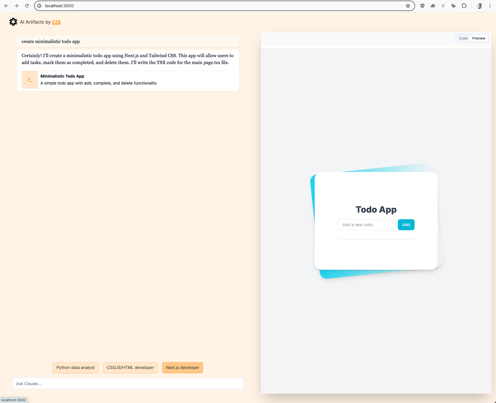

# AI Artifacts - Open Source Anthropic Artifacts
This app is an open source version of [Anthropic's Artifacts UI](https://www.anthropic.com/news/claude-3-5-sonnet) in their [Claude chat app](https://claude.ai/).

This app is using [E2B](https://e2b.dev/docs)'s [Code Interpreter SDK](https://github.com/e2b-dev/code-interpreter) for AI code execution. E2B provides a cloud sandbox to run AI-generate code securly and can handle installing libraries, running shell commands, run Python, JavaScript, R, and Nextjs apps and more.




## Features
- [Anthropic Claude Sonnet 3.5](https://www.anthropic.com/) model for AI code generation
- [Code Interpreter SDK](https://github.com/e2b-dev/code-interpreter) from [E2B](https://e2b.dev) for secure AI code execution using sandboxes
- [Vercel AI SDK](https://sdk.vercel.ai/docs/introduction) for tool calling and streaming responses from the model
- Supported AI-generated code
  - ✅ Running AI-generated Python in Jupyter notebook
  - ✅ AI-generated Next.js apps
  - TODO: vanilla JS/TS, R

### 1. Install dependencies
```sh
npm i
```

### 2. Set API keys
Create a `.env.local` file and set the following:
```sh
# Get your API key here - https://e2b.dev/
E2B_API_KEY="your-e2b-api-key"
ANTHROPIC_API_KEY="your-anthropic-api-key"
```

### 3. Run
```sh
npm run dev
```
